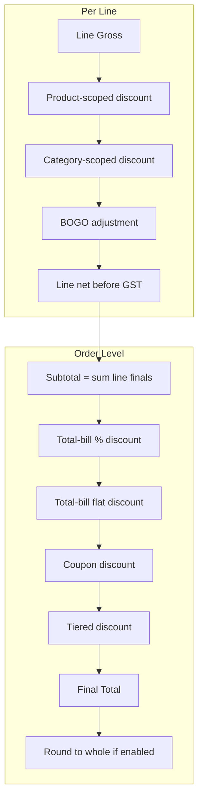

# Discount and Rounding Implementation Plan (Revised)

## Overview

Implement a comprehensive discount system with **percentage, flat amount, BOGO, coupons, and tiered/volume discounts**, each applicable by **scope** (Product, Category, Total bill) and toggleable from Settings. Add a toggle to round the final bill to the nearest whole number. Schema changes are applied directly (no migrations, fresh start).

---

## Discount Scope (Product / Category / Total Bill)

Every discount applies at one of three scopes:

| Scope | Description | Where applied | Example |
|-------|-------------|---------------|---------|
| **Product** | Specific item(s) | Selected line(s) in invoice | 10% off Rice |
| **Category** | All items in a category | Lines whose product belongs to that category | 5% off all "Grains" |
| **Total bill** | Entire order | After all line totals | Rs. 50 off orders over Rs. 500 |

---

## Categories (New Feature)

Categories are a **separate list** (like Items, Units) used to group products for category-scoped discounts.

### Schema: categories
- `id INTEGER PRIMARY KEY`
- `name TEXT NOT NULL UNIQUE`
- `sort_order INTEGER NOT NULL DEFAULT 0`
- `created_at`, `updated_at`

### Schema: item_categories (many-to-many)
- `item_id INTEGER REFERENCES items(id) ON DELETE CASCADE`
- `category_id INTEGER REFERENCES categories(id) ON DELETE CASCADE`
- `PRIMARY KEY (item_id, category_id)` — an item can belong to multiple categories

### UI
- **Settings or Items page**: Manage categories (CRUD)
- **Items page**: Assign item to category/categories (multi-select or tags)
- **Invoice form**: Category-scoped discounts auto-apply to lines whose product has that category

---

## Discount Types and Scope Matrix

| Type | Product scope | Category scope | Total bill scope | Settings key |
|------|---------------|----------------|------------------|--------------|
| Percentage | Yes | Yes | Yes | `discount_percentage_enabled` |
| Flat amount | Yes | Yes | Yes | `discount_flat_enabled` |
| BOGO | Yes (per line) | Yes (per qualifying line) | N/A | `discount_bogo_enabled` |
| Coupons | N/A | N/A | Yes | `discount_coupon_enabled` |
| Tiered/Volume | N/A | N/A | Yes | `discount_tiered_enabled` |

---

## Schema Changes ([schema.ts](src/main/db/schema.ts))

### New tables
- **categories** — list of categories
- **item_categories** — item ↔ category mapping

### Invoices
- `order_discount_amount REAL NOT NULL DEFAULT 0`
- `round_to_whole INTEGER NOT NULL DEFAULT 0`
- `coupon_code TEXT`

### Invoice_lines
- `line_discount_percent REAL NOT NULL DEFAULT 0`
- `line_discount_flat REAL NOT NULL DEFAULT 0`
- `bogo_buy_qty REAL`, `bogo_get_qty REAL`, `bogo_discount_percent REAL`

### Coupons
- `code`, `discount_type`, `discount_value`, `min_order_amount`, `valid_from`, `valid_to`, `usage_limit`, `used_count`

### Tiered_discount_rules
- `min_order_amount`, `discount_percent`, `sort_order`

---

## Discount Application Logic by Scope

### Product-scoped
- User selects line(s) and applies % or flat discount to those lines
- BOGO: user sets buy_qty, get_qty on a specific line

### Category-scoped
- User selects a category (e.g. "Grains") and % or flat discount
- System applies to all invoice lines whose product has that category

### Total-bill-scoped
- Order-level % or flat discount
- Coupon (code-based)
- Tiered rule (e.g. 10% off when total >= 500)

---

## Calculation Flow (with scope)

---

## Settings Page

### Discount toggles (per type)
- Enable percentage discount
- Enable flat amount discount
- Enable BOGO discount
- Enable coupons
- Enable tiered/volume discount

### Rounding
- Round final bill to nearest whole number

### Category management
- Add/edit/delete categories (or link to dedicated Categories section)

---

## Implementation Order

1. Schema: categories, item_categories, invoice/line discount columns, coupons, tiered_rules
2. Categories CRUD + Items page: assign items to categories
3. Settings: discount toggles, round-to-whole
4. Shared discount logic (product-, category-, total-bill-scoped)
5. Invoice form UI: scope selector (Product / Category / Total bill) + discount inputs
6. Backend: persist discount fields, coupon validation
7. PDF export: discount breakdown, rounded total
8. Coupon + tiered rules management UI
