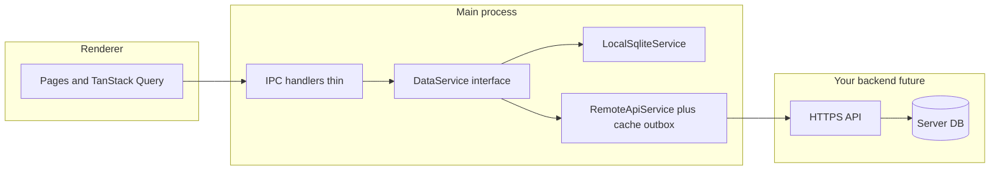

# Local + optional cloud: architecture brainstorm

Your app today is **local-first by design**: `[better-sqlite3](src/main/db/index.ts)` in the Electron **main** process, a large set of `**ipcMain.handle` routes** in `[src/main/db/handlers.ts](src/main/db/handlers.ts)`, and a typed façade in `[src/main/preload.ts](src/main/preload.ts)`. The renderer effectively treats `window.electronAPI` as its data layer.

There is already a detailed options write-up in `[.cursor/plans/local-and-remote-db-architecture_c06e2e50.plan.md](.cursor/plans/local-and-remote-db-architecture_c06e2e50.plan.md)` (direct DB vs API vs sync frameworks). The recommendations below align with that doc and your codebase.

---

## Should the “service layer” be different?

**Short answer:** evolve it rather than bolt on a second parallel stack in the renderer.

| Layer        | Today                                    | Suggested direction                                                                                                                                                                             |
| ------------ | ---------------------------------------- | ----------------------------------------------------------------------------------------------------------------------------------------------------------------------------------------------- |
| **Renderer** | TanStack Query + calls to preload        | Keep **domain-agnostic** calls (same IPC shape). Optionally a thin `dataClient` module that only forwards to preload so tests can mock one surface.                                             |
| **Main**     | SQL + business rules inside IPC handlers | Introduce a **single abstraction** (e.g. `DataService` / repository modules per aggregate) that handlers **delegate** to. Handlers stay thin: validate IPC payload → call service → return DTO. |
| **Remote**   | N/A                                      | **HTTP API + server DB**, not raw DB sockets from the client. A “remote” implementation of the same service interface calls the API; local mode uses SQLite only.                               |

**Why not two different “service layers” (one local, one cloud) in the UI?**  
You would duplicate branching, error handling, and caching in every screen. Better: **one contract** from renderer → main, and **two implementations** in main (local SQLite vs remote API + local cache/outbox), selected from settings.

**Optional later split:** if you want **mobile/web without Electron**, the natural second step is the **same HTTP API** those clients call directly; the desktop can keep using IPC that internally uses the same client library as mobile. That avoids three divergent code paths.

---

## “Best ideas” condensed (aligned with your goals)

1. **API + server DB (not client → Postgres over the internet)** — security, auth, migrations, and multi-client reuse (mobile/web) stay on the server. This matches **Option 3** in the existing plan.
2. **Settings-driven modes** — e.g. `local_only` vs `cloud_enabled` (base URL, tenant/org id, tokens). Store in your existing `settings` table; main process picks implementation at startup (and on settings change, with care for in-flight operations).
3. **Offline-first when cloud is on** — treat local SQLite as **cache + outbox** (queued writes, retry, backoff). Reads can prefer network when online, fall back to cache when offline.
4. **Stable DTOs / versioning** — server API versioned (`/v1/...`) so old app builds do not break when schema evolves; migrations live server-side.
5. **Identity and multi-tenancy early** — even if v1 is “single shop per account,” model **org/shop id** on the server so you do not paint yourself into a corner.
6. **Framework vs custom sync** — custom outbox + timestamps is flexible; **RxDB / PowerSync / ElectricSQL / Couch-style** can speed replication if you accept product constraints. Worth a spike, not required on day one.

---

## Caveats of adding cloud support (practical risks)

- **Conflicts and invariants** — stock, invoices, and allocations are **not last-write-wins friendly**. You need rules (e.g. server authoritative for stock movements, or operational transform / domain-specific merge) and idempotent APIs (`clientMutationId`, unique constraints).
- **Transactions across boundaries** — today SQLite transactions span multiple tables in one handler. Over the network you get **partial failure**; design **sagas** or **server-side aggregate endpoints** that mirror one business operation.
- **Files and paths** — schema includes paths like `invoice_file_path` (`[supplier_purchases](src/main/db/schema.ts)`). Cloud means **object storage** (S3-compatible) + metadata in DB, not local filesystem assumptions on other clients.
- **Security and compliance** — TLS, token storage, rotation, rate limits, audit logs, and regional/data obligations (GST/business data) become your responsibility once data leaves the device.
- **Auth model** — local PIN/users vs server accounts; mapping `users` / `activity_logs` to server identity; **device registration** and revoke stolen devices.
- **Clock skew** — `created_at` / `updated_at` trust; prefer **server timestamps** for sync ordering where it matters.
- **Deletes and tombstones** — soft-delete or tombstone rows so sync does not resurrect deleted entities.
- **Backup / export / import** — today users can export SQLite (`[db:exportDb](src/main/db/handlers.ts)`). With cloud, define whether export is **local cache**, **server snapshot**, or both; avoid two truths without a documented merge story.
- **Operational cost** — hosting, monitoring, incident response, and backward compatibility for older app versions.
- **Testing** — E2E and integration tests need **hermetic server** or contract tests; flaky network simulation becomes part of CI.

---

## Direct answer: “make the service layer different?”

- **Yes in structure, no in count of public surfaces:** refactor **main-process** access into a clear service/repository layer with **one IPC contract** to the renderer.
- **Do not** scatter “if cloud then fetch else sqlite” across React components; keep cloud/local switching **below IPC** (or entirely in main).

For a fuller phased migration (outbox, `IDataService`, settings toggle), reuse the steps in `[.cursor/plans/local-and-remote-db-architecture_c06e2e50.plan.md](.cursor/plans/local-and-remote-db-architecture_c06e2e50.plan.md)`.